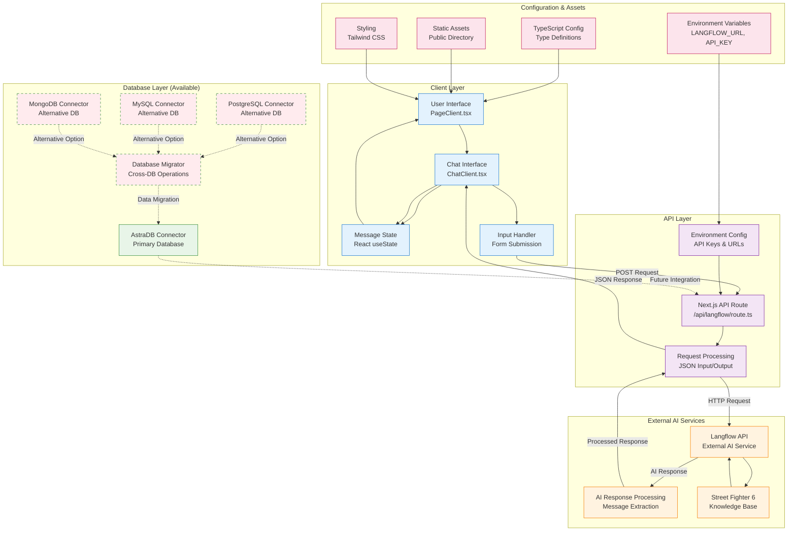

# AI Fighting Game Coach - Data Flow Diagram

## Data Architecture Overview



## Data Flow Patterns

### 1. User Interaction Flow
```
User Input → ChatClient → State Update → Form Submission → API Route → Langflow → AI Response → UI Update
```

### 2. Message Processing
```
Raw Input → JSON Payload → HTTP Request → AI Processing → Response Extraction → State Management → UI Render
```

### 3. Error Handling
```
API Error → Error State → User Notification → Input Reset
```

## Data Structures

### User Message
```typescript
interface Message {
  text: string;
  isUser: boolean;
}
```

### API Request
```typescript
interface APIRequest {
  input: string;
}
```

### API Response
```typescript
interface APIResponse {
  data?: any;
  error?: string;
}
```

### Langflow Payload
```typescript
interface LangflowPayload {
  input_value: string;
  output_type: "chat";
  input_type: "chat";
}
```

## Component Relationships

### Frontend Components
- **PageClient.tsx**: Main page wrapper with layout
- **ChatClient.tsx**: Core chat functionality and state management
- **layout.tsx**: Root layout and global styles
- **page.tsx**: Server component entry point

### Backend Components
- **route.ts**: API endpoint for Langflow communication
- **astradb_connector.py**: Database connectivity (unused)

### Configuration
- **package.json**: Dependencies and scripts
- **tsconfig.json**: TypeScript configuration
- **next.config.ts**: Next.js configuration

## Data Security

### Environment Variables
- `LANGFLOW_URL`: External AI service endpoint
- `LANGFLOW_API_KEY`: Authentication token

### Authentication
- Bearer token authentication for Langflow API
- No user authentication currently implemented

## Future Enhancements

### Database Integration
- Connect Python database connectors to frontend
- Implement user session persistence
- Add conversation history storage

### Enhanced Data Flow
- Real-time message streaming
- User authentication and profiles
- Analytics and usage tracking
- Error logging and monitoring

## Technical Stack

### Frontend
- Next.js 15 with React 19
- TypeScript for type safety
- Tailwind CSS for styling
- Client-side state management

### Backend
- Next.js API routes
- Python database connectors
- Multiple database support
- Environment-based configuration

### External Services
- Langflow for AI processing
- DataStax Langflow client
- Street Fighter 6 knowledge base